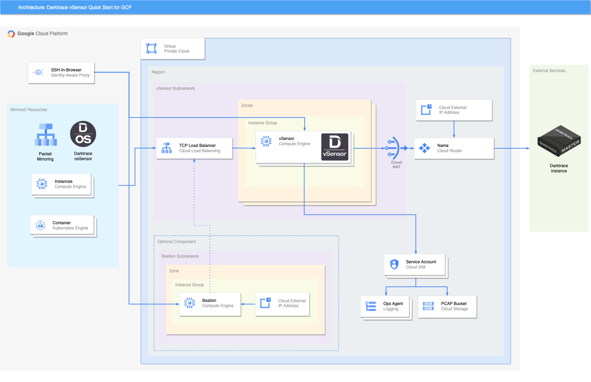

# Darktrace vSensor Quickstart for GCP

## Introduction

This Quick Start deploys Darktrace vSensor virtual threat detection on Google Cloud Platform. Instead of relying on flow logs, Darktrace probes analyze raw data from mirrored virtual private cloud (VPC) traffic to learn to identify threats. This guide covers the steps necessary to deploy this Quick Start.

GCP Virtual Private Cloud (VPC) traffic mirroring copies traffic from Computing Engine instances you want to monitor. A Load Balancer distributes mirrored traffic to Darktrace vSensor probes in a private subnet. The deployment also supports sending data to vSensors from Darktrace osSensors you configure on virtual machines and containerized applications.

Darktrace vSensor stores PCAP data from mirrored traffic and stores it in a Google Storage bucket for later recall from the Threat Visualizer.

## Architecture

The GCP Darktrace vSensor Quick Start deploys the following:

- (Optional) A VPC, or provide an existing VPC to deploy into
- A Subnet for containing the internal vSensors
- A Cloud Router to provide vSensors with appliance / update connectivity
- A Managed Instance Group containing vSensors with predictive autoscaling
- A GCP Storage bucket for storing PCAPS for later analysis
- (Optional) A Bastion subnet and host for allowing external access to the vSensors
- An Internal TCP Load balancer with automatic Packet Mirroring for the Bastion.
- (Optional) Load balancer frontend for osSensor support
- IAM role assignments configuring storage bucket and GCP Ops Agent logging
- Firewall rules for allowing traffic mirroring, external bastion access and SSH-in-browser via IAP
- (Optional) User and public ssh key for ssh public key authentication

## Requirements

### Enabled APIs
The following GCP APIs are required for deploying this template:

- Compute Engine
- Deployment Manager v2
- Identity and Access Management (IAM)
- IAM Service Account Credentials
- Cloud Resource Manager
- Cloud Logging
- Cloud Monitoring

### IAM Roles
It is recommended that a project owner deploys the template in the respective project.

Furthermore, the "Google APIs Service Agent" IAM principal (in the form of `<PROJECT_ID>@cloudservices.gserviceaccount.com`) in the deployment project requires an additional role to apply the vSensor service account it's own rules:

- resourcemanager.projects.setIamPolicy

This may be achieved by setting this principal as `Owner` of the project, but applying the role manually instead is well advised.

### Traffic Ingestion

**Please note that the template uses regional resources, it is necessary for separate deployments using separate Probe Push Tokens per region.**

Traffic can be ingested for analysis by Darktrace using a combination of two methods:

- [Packet Mirroring](https://cloud.google.com/vpc/docs/packet-mirroring)
- Installing Darktrace osSensors on compatible instances

In both cases, extra configuration is required to permit access from mirrored resources to the Quick Start deployment using VPC peering / other routing.

## Deploying the Quick Start

This Quick Start can be deployed using the `gcloud` command line utility which can be installed and configured using instructions [here](https://cloud.google.com/sdk/docs/install-sdk). Make sure to select the correct project you wish to deploy the Quick Start into.

A sample configuration file `launch.yaml` is provided. Fill this with configuration parameters, using `launch.py.schema` for further information about the available parameters.

Create a new deployment with:

`gcloud deployment-manager deployments create <YOUR_DEPLOYMENT_NAME> --config launch.yaml`

If you need to correct a parameter/update the deployment, some changes may be possible by updating the template:

`gcloud deployment-manager deployments update <YOUR_DEPLOYMENT_NAME> --config launch.yaml`

The deployment can be deleted with:

`gcloud deployment-manager deployments delete <YOUR_DEPLOYMENT_NAME>`

**Please note, deleting the deployment requires:**
- removing temporary holds and retention settings to empty the PCAP bucket
- removing any additional packet mirroring sessions and frontend (forwarding rules) created outside the template

### Configuration Options

The Quick Start can be deployed into a new VPC it creates automatically, or the `existing-vpc-name` parameter can be set to deploy into new subnets within an existing VPC in your project. 

A bastion host can be configured optionally using the `bastion-enable` boolean parameter. If you already have access to your resources via some other means, or only wish to use SSH-in-browser/IAP, this can be disabled.

If the `ossensor-hmac` parameter is not given, osSensors will not be able to register with the deployment. **This cannot be changed later without redeploying entirely.**

Setting the configured instance size, scaling counts, PCAP storage retention and ultimately the mirrored traffic bandwidth will affect the ongoing deployment cost.

Many regions have GCP Storage bucket support, whenever possible this Quick Start will pick this region to reduce PCAP data transfer costs.
In cases where the vSensor region does not have an exact match with a GCP Storage region, this template will choose another as close as possible.

The bastion (if enabled) and the vSensor can be configured optionally with user and ssh public key for ssh public key authentication using the `bastion-ssh-user-key` and the `mig-ssh-user-key` variables.

Consider reviewing:
- https://cloud.google.com/compute/vm-instance-pricing
- https://cloud.google.com/storage/pricing

## Post deployment

### Confirming Operation

Once deployment has been successfully completed:

- Wait a few minutes for the vSensor instances to install and configure themselves.
- Confirm a vSensor has appeared in System Status of your Appliance Threat Visualizer using the dedicated Push Token you used in the deployment.
- Follow the guide below to configure osSensor / packet mirroring sessions and check they appear in the threat visualizer after a few minutes.

### Template Outputs

This deployment template provides outputs to ease configuration of osSensors and traffic mirroring. These can be accessed by:

- Go to [Deployment Mananger](https://console.cloud.google.com/dm/deployments/) in the GCP Console.
- Clicking on the deployment name.
- Click the Layout `View` link.
- Outputs will be listed with `finalValue` keys at the top of the resulting layout.

These outputs include:
- The IP address of the vSensor load balancer to configure osSensors for. You will need to configure any VPC peering/routing to allow osSensor instances to access the vSensor subnet provided, which includes this IP.
- The subnet CIDR for easy reference of the above.
- The PCAP bucket name, to confirm the vSensors are writing to it. Each vSensor will create a numerical directory (its Compute Engine Instance ID) once it receieves mirroring traffic.
- Created VPC and subnet names.

### Packet Mirroring

To configure packet mirroring, you must:
- Configure the [load balancer](https://console.cloud.google.com/net-services/loadbalancing/list/loadBalancers) to add further Frontend subnets.
- Create a [packet mirroring policy](https://console.cloud.google.com/networking/packetmirroring) connected to the load balancer.

### Logging / Metrics

Google Ops Agent is configured on the vSensors and bastion automatically to provide more detailed statistics including CPU, memory and bandwidth.

It also provides [Log Explorer](https://console.cloud.google.com/logs/) logs in four 'Log Name' groups for supporting debugging:
- `vsensor-syslog` For general syslog logging.
- `vsensor-updates` For logging from apt/dpkg package updating of the vSensor and OS packages.
- `vsensor-services` For logging from the main vSensor product components.
- `vsensor-userdata` For logging from the initial vSensor installation.

### Support

Please use the [Darktrace Customer Portal](https://customerportal.darktrace.com) to request support in using this template.

For issues during initial installation, provide any GCP Deployment Manager errors and `vsensor-userdata` (see previous section). 
